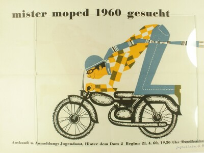

# Anleitung zur Erstellung einer GIF-Animation von einem Bild

__Vorher__

__Nachher__

## Werkzeuge

In diesem Workshop verwenden wir ausschliesslich Webanwendungen, so dass wir nur einen Browser brauchen.

- [Pixlr X](https://pixlr.com/de/x/)
- [EZGif](https://ezgif.com/maker)

## Prozess

1. Originalbild herunterladen
1. In Pixlr X das Bild öffnen
1. Aus dem Bild ein Hintergrundbild und ein Bild für Bewegungen erstellen (mit Funktionen "Zuschneiden", "Ausschnitt" und "Zeichnung")

__Beispiel Hintergrundbild__

__Beispielbild für Bewegungen__

1. In Pixlr X diese beiden Bilder in 2 unterschiedlichen Layers(Ebenen) öffnen
1. Das Bild mit Charakter bewegen (verschieben/drehen usw.) und mit der Hintergrundbild kombinieren
1. Die einzelnen Bilder (bewegter Charakter und Hintergrund) speichern. Es entstehen mehrere Bilder (s. Beispiele unter "./resource/image/example_img_v1.jpg" bis "./resource/image/example_img_v12.jpg")
1. Die so entstandenen Bilder in EZGif hochladen
1. Die Animation Konfigurieren und ein GIF erstellen!