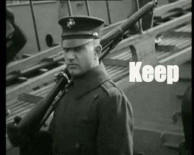

# Anleitung zur Erstellung einer GIF-Animation von einem Video

__Vorher__

Die Video-Sequenz von [diesem Video (zwischen ca. 57sek und 62sek)](https://www.europeana.eu/en/item/2051906/data_euscreenXL_https___www_openbeelden_nl_media_788653)

__Nachher__

Beispiel mit Caption

## Werkzeuge

In diesem Workshop verwenden wir ausschliesslich Webanwendungen, so dass wir nur einen Browser brauchen.

- [EZGif](https://ezgif.com/maker)
- [GifnText](http://www.gifntext.com/)

## Prozess

1. Das Video herunterladen
1. In EZGif die Video-Datei hochladen
1. Die entsprechende Sequenz auswählen und daraus eine GIF-Datei erstellen (__die Datei-Grösse anpassen!!__)
1. Die GIF-Datei in GifnText hochladen
1. Texte hinzufügen und eine neue GIF-Datei erstellen

