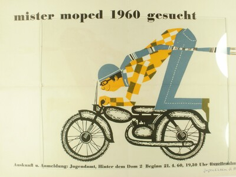
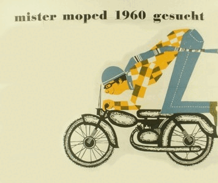
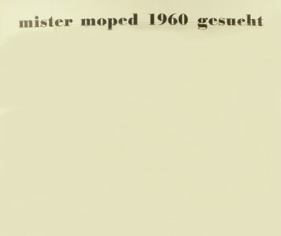
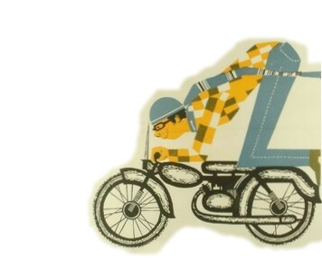

# Workshop GIF-Animationen Erstellen

## Agenda
- GIF und GifItUp? - ca. 10 min 
- [Hands-on mit einem Video](./anleitung_vid.md) - ca. 10 min
- [Hands-on mit einem Bild](./anleitung_img.md) - ca. 15 min
- ... und selber Medien (Bilder oder Videos) suchen und eine GIF-Animation erstellen!

---

## Ressourcen

- Aushang Mister Moped 1960 gesucht - Freilichtmuseum Roscheider Hof, Germany - CC0.
https://www.europeana.eu/item/192/item_AHNKJPZOSREF6T2424RP65NOO3JSNWXR

- Visit of the american cruiser pittsburg by Polygoon-Profilti (producent) - Netherlands Institute for Sound and Vision, Netherlands - Public Domain.
https://www.europeana.eu/item/2051906/data_euscreenXL_https___www_openbeelden_nl_media_788653

---

# GIF und GifItUp?

__Kurz & Einfach__

- GIF ist ein Datenformat.
- GifItUp ist eine Veranstaltung.

---

## GIF?

- Abkürzung von Graphics Interchange Format
- effiziente Kompression mit Lempel-Ziv-Welch-Algorithmus (LZW)
- Zwei Versionen GIF87a/GIF89a (GIF89a ermöglicht Animation)

---

## GifItUp?

- [GifItUp](https://gifitup.net/) ist ein von Europeana organisierter Wettbewerb
- Er findet immer im Oktober statt - also bald!
- [Beispiele](https://giphy.com/gifitup)

---

# Anleitung zur Erstellung einer GIF-Animation von einem Video

__Vorher__

[Die Video-Sequenz (zwischen ca. 57sek und 62sek)](https://nbtkmy.github.io/Gif_workshop/resource/video/example_vid.mp4)

---

__Nachher__

Beispiel mit Caption

---

## Werkzeuge

In diesem Workshop verwenden wir ausschliesslich Webanwendungen, so dass wir nur einen Browser brauchen.

- [EZGif](https://ezgif.com/maker)
- [GifnText](http://www.gifntext.com/)

---

## Prozess

1. Das Video herunterladen
1. In EZGif die Video-Datei hochladen
1. Die entsprechende Sequenz auswählen und daraus eine GIF-Datei erstellen (__die Datei-Grösse anpassen!!__)
1. Die GIF-Datei in GifnText hochladen
1. Texte hinzufügen und eine neue GIF-Datei erstellen

---

# Anleitung zur Erstellung einer GIF-Animation von einem Bild

__Vorher__

---

__Nachher__

---

## Werkzeuge

In diesem Workshop verwenden wir ausschliesslich Webanwendungen, so dass wir nur einen Browser brauchen.

- [Pixlr X](https://pixlr.com/de/x/)
- [EZGif](https://ezgif.com/maker)

---

## Prozess

1. Originalbild herunterladen
1. In Pixlr X das Bild öffnen
1. Aus dem Bild ein Hintergrundbild und ein Bild für Bewegungen erstellen (mit Funktionen "Zuschneiden", "Ausschnitt" und "Zeichnung")

---

## Prozess

__Beispiel Hintergrundbild__

---

## Prozess

__Beispielbild für Bewegungen__

---

## Prozess

4. In Pixlr X diese beiden Bilder in 2 unterschiedlichen Layers(Ebenen) öffnen
1. Das Bild mit Charakter bewegen (verschieben/drehen usw.) und mit der Hintergrundbild kombinieren
1. Die einzelnen Bilder (bewegter Charakter und Hintergrund) speichern. Es entstehen mehrere Bilder (s. Beispiele [hier](https://github.com/NbtKmy/Gif_workshop/tree/main/resource/image))

---

## Prozess

7. Die so entstandenen Bilder in EZGif hochladen
1. Die Animation Konfigurieren und ein GIF erstellen!

---

_Jetzt erstellen wir eigene Animationen für GifItUp!_ 
# DIY
1. Bilder/Videos mit passenden Lizenzen aus den folgenden Datenbanken aussuchen

--- 
# DIY

- [Europeana](https://www.europeana.eu/en)
- [Trove](https://trove.nla.gov.au/)
- [Digital Public Library of America (DPLA)](https://dp.la/)
- [DigitalNZ](https://digitalnz.org/)
- [Japan Search](https://jpsearch.go.jp/)
- [DAG Museums](https://dagworld.com/)
- [Art Institute of Chicago](https://www.artic.edu/)

---

# DIY
2. Sich vorstellen, wie die GIF-Animation aussehen soll
1. Werkzeug auswählen und ...los!
1. Achtung! Dateigrösse muss unter __2 MB__ sein!

---

## Weiteres

- [Beispielmaterialien](https://github.com/NbtKmy/Gif_workshop/tree/main/resource)

- [Weitere Anleitungen (Link zu GifItUp-Seite)](https://gifitup.net/how-to-make-a-gif/)
